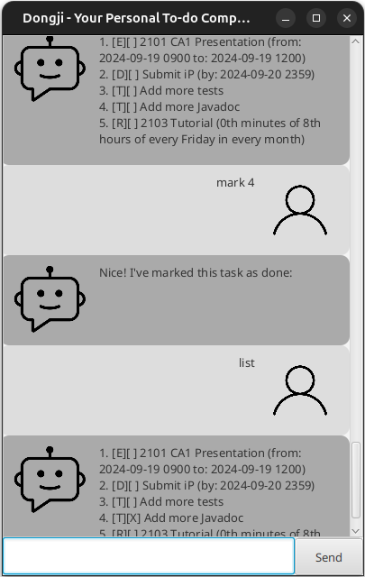

# Dongji User Guide
# Dongji



Welcome to Dongji! This product helps you manage your tasks efficiently.

## How to install

Download the JAR from the [GitHub Repo](https://github.com/zzawook/ip). 
Navigate to 'Releases' tab at the right and download the latest version of
JAR.

## Features

### Adding Todo

To add a todo, use the following command:
```
todo <task name>
```
This command adds a task to the task list.

#### Example:
```
todo Buy groceries
```

### Adding Deadline

To add a task with a deadline, use the following command:
```
deadline <task name> /by <yyyy-mm-dd [hhmm; optional]>
```
This command adds a task with a specified deadline to the task list.

#### Example:
```
deadline Submit assignment /by 2023-10-15 2359
```

### Adding Event

To add an event with a start and end date-time, use the following command:
```
event <task name> /from <yyyy-mm-dd [hhmm; optional]> /to <yyyy-mm-dd [hhmm; optional]>
```
This command adds an event task with a start and end date-time.

#### Example:
```
event Team meeting /from 2023-10-20 1000 /to 2023-10-20 1200
```

### Adding Recurring Task

To add a recurring task, use the following command:
```
recur <task name> <cron; * * * * *>
```
This command adds a recurring task to the task list.

#### Example:
```
recur Water plants 0 7 * * *
```

### Listing tasks

To list all tasks in the task list, use the following command:
```
list
```
This command lists all tasks with their task numbers.

### Marking / Unmarking Tasks

To mark a task as done, use the following command:
```
mark <task number>
```
To unmark a task as not done, use the following command:
```
unmark <task number>
```

#### Example:
```
mark 1
unmark 1
```

### Delete tasks

To delete a task from the task list, use the following command:
```
delete <task number>
```

#### Example:
```
delete 1
```

### Finding with Keyword

To find all tasks with a specific keyword, use the following command:
```
find <keyword>
```

#### Example:
```
find groceries
```

### Help

To show the list of commands, use the following command:
```
help
```

### Exiting the Application

To exit the application, use the following command:
```
bye
```